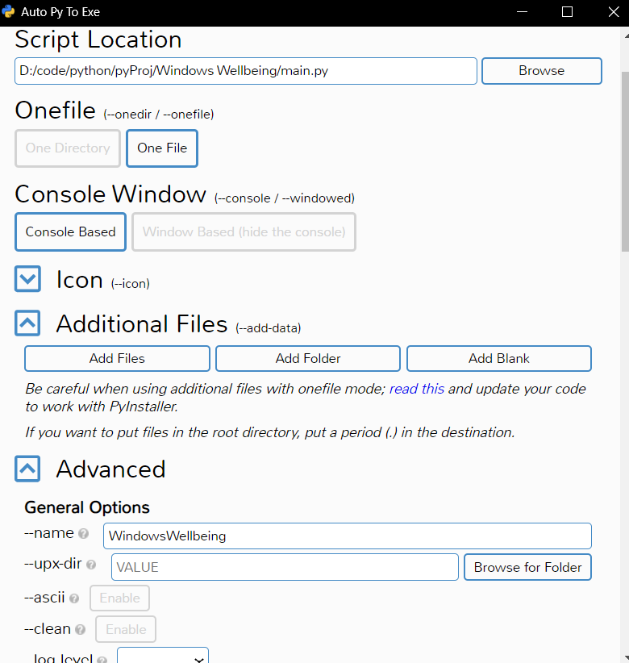
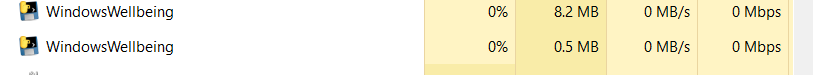

# Windows Wellbeing
Windows-Wellbeing is simple commandline based application which can be used to track of apps and softwares that we use daily. It is similar to digital wellbeing but made for Windows. 
For storing data, json file is used. Script generates json file named `tracker.json` where it stores its all data.
`tracker.json` file will get created in same folder from where script is running in terminal.

## How script works:
&nbsp;&nbsp;&nbsp;&nbsp;&nbsp;After running script, it checks if `tracker.json` file is present. If not, then it creates new file. If file is present, but it's empty or has some issue with file, then it rewrites that file with template present in code. 
&nbsp;&nbsp;&nbsp;&nbsp;&nbsp;Afterwards loop is executed in which script collects currently focused app and then adds sleep timer of 60 seconds. Afterwards, again current focused app name is collected. If previous and current name matches, then it adds that app to foreground category, else adds to background apps category.
&nbsp;&nbsp;&nbsp;&nbsp;&nbsp; Now to get list of apps running in background (which are not in focus or lost focus within 1 minute sleep time) script uses powershell command and lists all apps running(foreground and background). Then script tries to find app (if it was having focus in 1 minute period) and because it has incremented timer for that app in foreground apps category, script tries to find similar app with same name like focused app and that app is removed from list. 
&nbsp;&nbsp;&nbsp;&nbsp;&nbsp;Afterwards all the apps present in that list are added and incremented in background apps category.  

### Get started:
* #### To clone repository:
    ```
    git clone https://github.com/pratik0903/Windows-Wellbeing.git
    ```

* #### To setup project with all dependencies:
    ```
    pip install -r requirements.txt
    ```
* #### To compile into Executable file:
    I used `auto-py-to-exe` python package for compiling this file.<br/>
    <br/>
    you will see Complete status in the end.

* #### To run newly created exe file without opening terminal window
    In project directory, inside `Runner.vbs`, add your executable file path inside `Shell.Run` command.

    ```VBScript
        Shell.Run """{YOUR-ExecutableFile-PATH}""", 0, False
    ```
    
    Cheers!! :clinking_glasses:
    Now double-click `Runner.vbs` file from file explorer and it will start `WindowsWellbeing.exe` file without opening command prompt.<br/>
    :pushpin:After starting `WindowsWellbeing.exe` through `Runner.vbs`, `tracker.json` file will get created in the same directory as that of `Runner.vbs`.<br/>
    As you can see task manager shows that `WindowsWellbeing.exe` is running in background.<br/>
    <br/>
    Now you can continue with your work and script will note your timing with each app untill it gets interrupted.
    ###### In order to view your usage, open `tracker.json`. (Opening with VS code shows live changes happening to file)

* #### To run this process automatically at startup:
    In order to run this process in background at startup instead of manually starting `Runner.vbs` everytime you log on to computer, we need to use `Windows Task Scheduler`.

    ##### Steps to follow:
    - Open `Windows Task Scheduler`.
    - Right-click `Task Scheduler Library` and add New folder(if you want to search this schedule task quicker) and give proper name to that folder.
    - Double-click on that folder and then go to `Action->Create Task`.
    - Create Task dialogue box will open
    - In `General` section, give any name and description
    - In security options, click on `Run only when user is logged on`
    - Under `Configure for` section, choose Windows 10
    - Inside `Triggers` section, click new.
    - In `Begin the task` choose `at log on` and tick for `any user`.In settings, click last option `Enabled`.
    - In `Actions` tab, click new and then make sure `Start a program` is selected under `Action`. In program/script, add `Runner.vbs` file full-path. Leave  `add arguments` empty and inside `Start in (optional)` add directory path of your `Runner.vbs` file with "\\" at end.
    - In `Conditions` tab, inside `Power` section, untick `start the task only if computer is on AC power`. And hit `Ok`.

 Congrats!!You scheduled this task to run automatically everytime computer boots up. :tada:
 But if you want to run it manually, right-click on taskname and choose `Run`. 
 If you want to stop this task which is running in background, Open `Task manager` and inside `Background Process`, find your task and right-click on it and choose `End task` and remove all instances of it.


    

